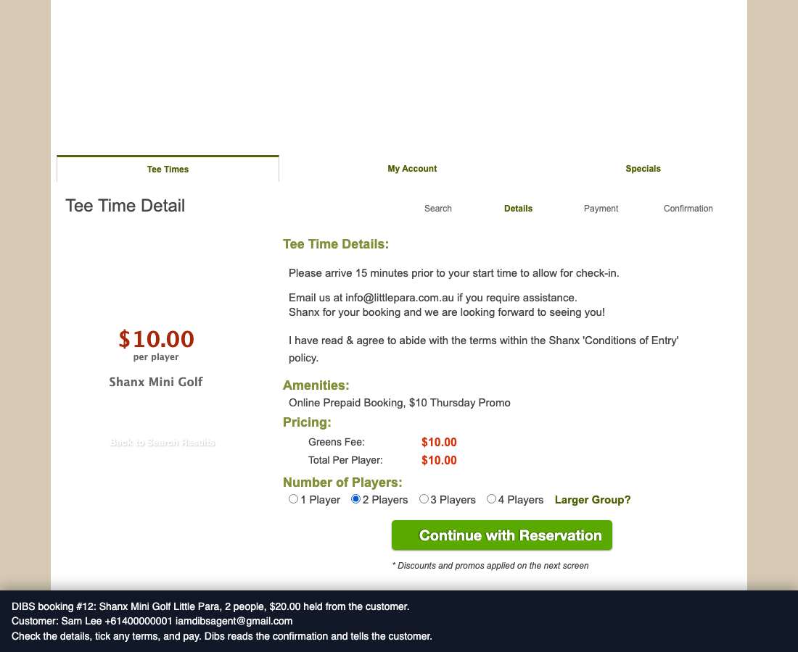

# Dibs

An iMessage agent that calls dibs on things to do.

Text it "I want to do something tomorrow at 4pm". It asks where you are and how far you will travel, offers a few ideas with real open slots and prices, sets up the one you pick, and texts you when a hard-to-get slot or ticket opens.

- **Live availability** from venue booking systems (Quick18, MiClub), plus a browser agent for sites with no feed
- **Alerts** for slots, on-sale dates and new shows, checked in the background with no AI cost
- **Memory** in plain text files you can read
- **Runs on one Mac for $0**: the Messages app is the gateway, a free model tier is the brain, OpenStreetMap is the map

**Try it:** send an iMessage to `iamdibsagent@gmail.com`. It answers when the host Mac is on.

Built for one city (Adelaide) and one category (experiences), in the spirit of the vertical agents from DoorDash and others. Change the city and the venue list to run it somewhere else.

## Setup

```bash
cd dibs
python3 -m venv .venv && .venv/bin/pip install -r requirements.txt
cp .env.example .env        # then add your free Gemini key
.venv/bin/pytest            # no key needed
```

**Models.** Each job has its own list of models, first choice then backups: `LLM_CHAT` (fast and cheap), `LLM_BROWSER` (the strongest you can afford), `LLM_MEMORY` (cheap). A model is written `provider@model`. Any OpenAI-compatible provider works; add one with `PROVIDER_<NAME>_URL` and `PROVIDER_<NAME>_KEY`. When a model is busy, out of quota or retired, the next one answers.

```bash
.venv/bin/python -m dibs.llm            # the model list for each job
.venv/bin/python -m dibs.llm --models   # the models your default key can use
```

## Run it

**1. Terminal simulator (start here).** Same agent, no phone:

```bash
.venv/bin/python -m dibs.cli
```

**2. Real iMessage, on this Mac.**

- Strongly recommended: make a separate macOS user account signed into a fresh Apple ID that is used only for the bot. Friends text that Apple ID's email address. Your personal messages never go near the bot.
- Grant Full Disk Access to Terminal (so it can read `chat.db`) in System Settings > Privacy & Security. Messages will ask for Automation permission on the first send.
- Set `ALLOWLIST` to your testers' numbers and `OPERATOR_HANDLE` to your own number. Leave `DRY_RUN=1` until replies look right, then set it to `0`.

```bash
.venv/bin/python -m dibs.channels.imessage
```

In group chats it only answers messages that contain `dibs`.

**Who can text it.** `ALLOWLIST` holds the numbers that get replies. Set `ALLOWLIST=*` to let anyone text the agent. Then these limits apply: 30 messages per hour and 120 per day for each person (`MAX_MSGS_PER_HOUR`, `MAX_MSGS_PER_DAY`), a `BLOCKLIST`, and STOP / START: a person who texts STOP gets no more messages and their alerts are cancelled. The agent only ever replies; it never texts a person first, except for an alert that person asked for.

**3. HTTP API** (for a paid gateway later): `.venv/bin/uvicorn dibs.api:app --reload`, then POST `{"handle": "...", "text": "..."}` to `/inbound`.

## How a booking gets done

After the user says YES, code (not the model) picks one route for the venue:

| Route | When | What happens |
|---|---|---|
| `link` | The venue has a live connector (`"connector"` in venues.json). | The bot re-checks that the slot is still open, then texts the link to that slot. The user finishes on the venue page. |
| `email` | The venue has a `"booking_email"` and the bot has a mailbox (`SMTP_USER` in `.env`). | The bot emails the booking request in the user's name. |
| `page` | The venue has a `"booking_url"`. | The bot texts the venue's booking page. |
| `concierge` | Everything else. | You get an alert and book by hand. |

Live connectors (read-only, they never submit a booking):

| Connector | Platform | File |
|---|---|---|
| `quick18` | Quick18 tee sheets | `dibs/connectors/quick18.py` |
| `miclub` | MiClub public tee sheets (most Adelaide golf clubs) | `dibs/connectors/miclub.py` |

`scripts/fingerprint.py` finds the platform of each venue, sets up Quick18 and MiClub connectors when it can, and saves a `contact_email` lead. A connector is never added for a site that sits behind a CAPTCHA or a bot check; those venues use the `page` route.

To send a venue's bookings by email, edit its entry in `data/venues.json`. Set `payment` to `at_venue` only when you have confirmed that the venue takes payment on arrival:

```json
"payment": "at_venue",
"booking_email": "bookings@venue.example"
```

## Browser agent (experimental)

For venues with a booking site but no live feed, the bot can open the site in a headless browser and read the open times (`dibs/browser.py`). An AI model picks one action at a time. It takes 1 to 2 minutes, so the answer is texted afterwards. Results vary between runs with a small free model; treat them as a best effort.

Limits enforced in code: it stays on the venue's site, stops at a CAPTCHA or bot check, stops at a payment form, and cannot press a button that completes a booking.

```bash
.venv/bin/python -m playwright install chromium     # one time
.venv/bin/python -m dibs.browser "https://booking.kingpinplay.com/date.php?venue=norwood" "Find open bowling times for 2 people on Wednesday near 4pm"
```

## Location

iMessage does not share a user's location by itself. The user gives it in one of three ways: a suburb ("I'm in Norwood"), a location pin from the Messages app, or a maps link. The bot saves it and lists the nearest venues first, with the distance. Place names are looked up with OpenStreetMap (free, no key).

## Alerts

"Text me if a Wednesday slot between 3pm and 5pm drops to $15." The bot saves an alert, checks the live feed every 30 minutes (`ALERT_INTERVAL_MINUTES`), and texts once when a real slot matches. The check uses no AI model.

```bash
.venv/bin/python -m dibs.alerts list
.venv/bin/python -m dibs.alerts run     # one check now; prints instead of texting
```

## Ticketed events

Concerts, festivals and sport come from two sources:

- **Ticketmaster** (optional): put a free key from developer.ticketmaster.com in `TICKETMASTER_API_KEY`. It covers the venues that sell through Ticketmaster; events sold only through other sellers (for example Ticketek) are not in it.
- **`data/events.json`**: a calendar you keep by hand for events Ticketmaster does not list. Each entry has a `source_url` and a `checked_at` date. Add `onsale_at` when a sale date is announced.

Two event alerts exist. `onsale` texts the user at 8am on a sale date, or 15 minutes before a sale with a known time. `new_show` texts when a new show for an artist or team appears (needs the Ticketmaster key). The bot sends a link only. It never buys tickets and never joins a queue.

```bash
.venv/bin/python -m dibs.events search "fringe"
.venv/bin/python -m dibs.events run      # one check now; prints instead of texting
```

## Memory

Memory is plain text files, one folder per user, in `data/memory/` (not published to Git). The chat agent appends notes to a daily log and reads the profile in every conversation. Once a day the bridge runs a tidy-up that merges the notes into `profile.md` and topic files. Search is a keyword match; there is no database.

```bash
.venv/bin/python -m dibs.memory consolidate   # run the tidy-up now
```

## Payments (optional, Stripe)

Off by default. With `PAYMENTS_ENABLED=1` and a Stripe **test** key in `STRIPE_SECRET_KEY`:

1. The booking summary is written by code and shows the exact total and the card ("Reply YES to book and pay $40.00 with Visa ending 4242").
2. A person with no saved card gets a link to a Stripe-hosted page and saves a card there (card, Apple Pay or Link). Dibs never sees card numbers.
3. On YES, Dibs puts a **hold** on the card for that total. No money is taken yet.
4. When the booking is confirmed, the hold is captured and the user is told. If the booking fails, is cancelled by the user, or is not completed within 2 hours, the hold is released.

Limits in code: a YES only counts for the exact summary the system sent; a live key is refused unless `PAYMENTS_LIVE=1`; no hold can exceed `MAX_CHARGE_CENTS` (default $300). Taking real money from other people makes you a merchant: get a registered business and advice on refunds and tax before you turn on live mode.

Users can also text "cancel my booking", "what have I booked?" and "remove my card".

## Completing bookings (you are the booking engine)

Until Dibs can pay venues by itself, a person completes each booking on the venue site.

1. A user says YES. You get an iMessage alert on `OPERATOR_HANDLE` with the venue, time, party size, amount held and booking link.
2. You make the booking on the venue site or by phone.
3. You reply to Dibs from your own phone, and the user is told at once:

```
booked 3 Ref STK-2291, lane 7        (captures the held amount)
failed 3 4pm is full                 (releases the hold)
jobs                                 (lists what is waiting)
```

**Supervised checkout (phase A).** With `SUPERVISED_CHECKOUT=1`, a held booking at a supported venue (Quick18 for now) opens a browser window on the Mac at the exact slot, with the number of players chosen and a Dibs banner that shows the customer's details. On the next pages Dibs fills in the name, email and phone. It never ticks terms, never presses continue or pay, and never touches card fields. You check the page and pay; Dibs reads the reference on the confirmation page, captures the hold and texts the customer. `open 3` opens the window again.



The same works in a terminal: `.venv/bin/python -m dibs.ops list | booked 3 "ref" | failed 3 "reason"`.

## Data

- `data/venues.json`: seeded by `scripts/seed_venues.py` (OpenStreetMap), platforms detected by `scripts/fingerprint.py`. Check each venue by hand, add `booking_url`, `price_notes`, `off_peak_notes`, then set `"verified": true`. Add venues OSM is missing. Verified venues rank first.
- `data/deals.json`: starts empty. Add real deals from venue specials pages using the shape in `deals.example.json`. Day, time, party-size and expiry rules are checked in code, so the bot never quotes a deal that doesn't apply.

## Guardrails

- The bot only knows venues and deals that its tools return; the prompt forbids inventing any.
- For venues with a live connector, a proposal is rejected unless the slot is on the live feed.
- `confirm_booking` refuses unless the user's own latest message is an explicit yes. Proposals expire after 30 minutes, and there's one open proposal per chat.
- The bridge never answers message history from before its first run, and never answers anyone outside `ALLOWLIST`.

## Layout

```
dibs/agent.py        one conversational turn: prompt, tool loop, reply
dibs/tools.py        search, deals, remember, propose/confirm booking (the money guard)
dibs/catalog.py      venue + deal catalog, deal-condition checks
dibs/connectors/     live availability readers (quick18, miclub)
dibs/alerts.py       watch a venue, text when a slot opens
dibs/events.py       concerts, festivals, sport: search and ticket alerts
dibs/memory.py       text-file memory and the daily tidy-up
dibs/geo.py          distance and place lookup
dibs/browser.py      browser agent: reads open times from a venue's booking site
dibs/supervised.py   phase A: prepared checkout window, reads the confirmation
dibs/executors.py    booking routes: link, email, page, concierge, paid
dibs/payments.py     Stripe: saved card, charge, refund
dibs/llm.py          model router: a model list per job, any OpenAI-compatible provider
dibs/channels/       imessage.py (Mac bridge)
dibs/cli.py          terminal simulator
dibs/ops.py          concierge console
dibs/api.py          FastAPI /inbound for future gateways
scripts/                seed_venues.py, fingerprint.py
```
